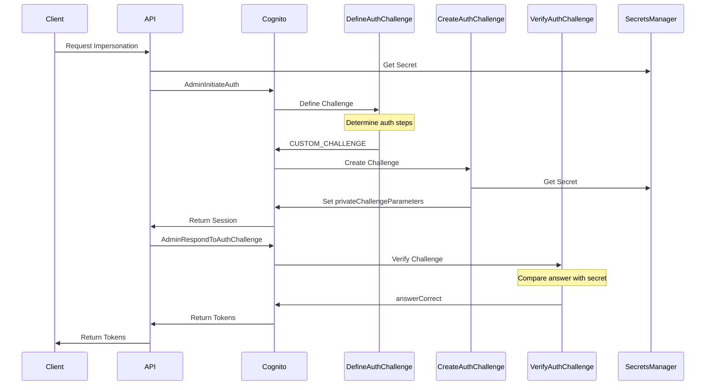

# PoC: Custom Auth Challenge with Cognito (Impersonation)

This project implements a user impersonation mechanism using AWS Cognito Custom Authentication in a PHP backend service
based on Symfony.
A classic use case is to allow support staff to authenticate as specific users for troubleshooting purposes
while maintaining security and audit trails.

## Usage

**Prerequisites:**

- AWS Access
- PHP >8.2 and composer installed
- Symfony CLI installed
- These envs set:

```text
  AWS_REGION=your-region
  AWS_COGNITO_USER_POOL_ID=your-pool-id
  AWS_COGNITO_CLIENT_ID=your-client-id
  AWS_SECRET_NAME=impersonation/secret
  AWS_PROFILE=default
```

**Note** This project uses AWS SSO as login provider. A slight change in the Service Code is needed to use other
AWS Credentials providers.

**Start the server:**

```bash
symfony server:start
# The project will be running on port 8000
```

or via Docker:

```bash
docker compose up -d
# The project will be running on port 8080
```

The [impersonate.http](./requests/impersonate.http) file contains a sample request to impersonate a user.

## How Custom Auth Challenge works

Cognito Custom Authentication involves a challenge-response flow with three Lambda triggers:

1. **Define Auth Challenge (defineAuthChallenge)**
    - Determines the authentication flow (e.g. USERNAME_PASSWORD, CUSTOM_CHALLENGE)
    - Tracks the number of attempts
    - Decides if authentication is successful or another challenge is needed

2. **Create Auth Challenge (createAuthChallenge)**
    - Generates the challenge sent to the user
    - In our case, sets the secret from Secrets Manager as the challenge (this will be the so called "private challenge
      Parameters")
    - Stores the secret in `privateChallengeParameters.code`
    - This information is only available to Lambda functions, not clients

3. **Verify Auth Challenge (verifyAuthChallenge)**
    - Validates the challenge response
    - Compares `challengeAnswer` with `privateChallengeParameters.code`
    - Returns true/false in `answerCorrect`



### Security Note

There is a reason why even good IdP like Cognito do not provide Imperonation out of the box and make it quite complex
to implement. Impersonation is a powerful feature that can be easily misused. To quote one of the articles below:


> It’s something that is super important for being able to provide adequate customer support, but it’s something
> developers often dread building.
> And that’s understandable, because it basically means building a backdoor into your well-secured product.
> You can hang attach a big, beefy lock to that door (e.g. only let users with an administrator role impersonate other
> users), but it’s a door nonetheless.

For this reason, it's important to complete the implementation with proper security measures:

- The secret should be secure and stored in a secure way (e.g. Secrets Manager) and be rotated very frequently
- The Token should be short-lived
- The impersonation feature should be disabled by default and only enabled for specific users
- The impersonation feature should be logged and audited
- A Rate Limiter should be implemented to prevent brute force attacks


## Good articles / resources

- [Impersonation using AWS Cognito](https://serverlessfolks.com/impersonation-using-aws-congito)
- [User Impersonation in AWS Cognito](https://medium.com/codex/user-impersonation-in-aws-cognito-dba39219f467)
- [AWS Cognito - Custom Authentication Flow](https://docs.aws.amazon.com/cognito/latest/developerguide/user-pool-lambda-challenge.html) 
