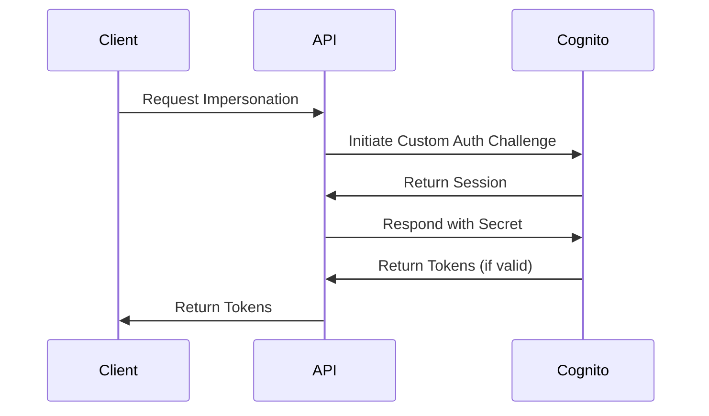
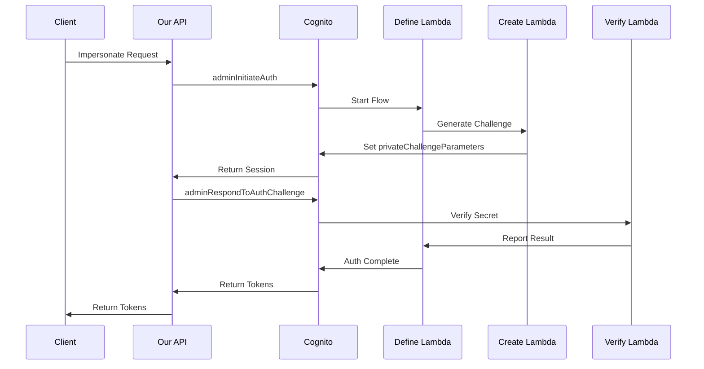

# PoC: Custom Auth Challenge with Cognito (Impersonation)

This project implements a user impersonation mechanism using AWS Cognito Custom Authentication in a PHP backend service
based on Symfony.
A classic use case is to allow support staff to authenticate as specific users for troubleshooting purposes
while maintaining security and audit trails.

## The Proof of Concept

At its core, this PoC consists of a single POST endpoint `/api/impersonate` that implements the impersonation flow. 
The implementation is minimal, using just two main classes: 
- [ImpersonationController](./src/Controller/ImpersonationController.php) handles the HTTP requests and input validation
- [CognitoService](./src/Service/CognitoService.php) manages the Cognito custom authentication flow.

Example request: see [impersonate.http](./requests/impersonate.http)

```json
POST /api/impersonate
Content-Type: application/json
        
{
    "targetUserId": "user123",
    "secretCode": "your-challenge-secret"
}
```

If successful, Cognito will provide authentication tokens for the target user, which are returned as:
```json
{
    "accessToken": "eyJhb....",
    "refreshToken": "eyJjd....",
    "idToken": "eyJhb....",
    "expiresIn": 3600
}
```

In case of errors (invalid secret, user not found, etc.), the endpoint returns appropriate HTTP status codes with error messages.

## Usage

**Prerequisites:**

- AWS Access
- PHP >8.2 and composer installed
- Symfony CLI installed
- These envs set:

```text
AWS_REGION=your-region
AWS_COGNITO_USER_POOL_ID=your-pool-id
AWS_COGNITO_CLIENT_ID=your-client-id
AWS_PROFILE=default
```

**Note** This project uses AWS SSO as login provider. A slight change in the Service Code is needed to use other
AWS Credentials providers.

**Start the server:**

```bash
symfony server:start    # Runs on port 8000
```

or via Docker:

```bash
docker compose up -d   # Runs on port 8080
```

The [impersonate.http](./requests/impersonate.http) file contains a sample request to impersonate a user.

## How Custom Auth Challenge works

### The Custom Auth Flow from the perspective of the client (PHP)

Cognito's Custom Authentication Challenge consists of two main steps in our code:

- Initiate Auth (`adminInitiateAuth`): 
  - We call Cognito with the target user's ID Cognito starts a new authentication session. 
  - The sdk method returns a session token for the next step. The challenge name and sessions are the "glue" that holds the flow together.
  
- Answer Challenge (`adminRespondToAuthChallenge`): 
  - We send the impersonation secret along with the session token
  - If valid, Cognito returns authentication tokens for the target user

This two-step flow ensures the validation secret never leaves AWS infrastructure while allowing us to implement secure user impersonation.
The client actually doesn't even know what happens in the authenticator or how the validation has been implemented. 
All what you need to know is which parameters to pass, here just a robust secret, but this can be anything really.


### Under the hood

Here's what happens under the hood with Cognito's Custom Auth lambdas:

1. **Define Auth Challenge** is the orchestrator. When a custom auth is initiated, this lambda:
   - Gets called after each auth attempt
   - Tracks how many attempts have been made
   - Decides what challenge should be next (e.g., `CUSTOM_CHALLENGE`)
   - Determines if authentication is successful or if another challenge is needed
   - Without this lambda, Cognito wouldn't know what step comes next or when auth is complete

2. **Create Auth Challenge** is the challenge generator. When a new challenge is needed, this lambda:
   - Creates/gets the actual challenge data (in your case, gets the secret from Secrets Manager)
   - Stores this as `privateChallengeParameters` (what the answer should be)
   - Can also set `publicChallengeParameters` (what gets sent to the client)
   - Without this lambda, there would be no challenge data to verify against

3. **Verify Auth Challenge** is the validator. When a challenge response comes in, this lambda:
   - Gets the user's answer and the `privateChallengeParameters`
   - Compares them to determine if the answer is correct
   - Returns true/false in `answerCorrect`
   - Without this lambda, Cognito couldn't verify if the challenge was answered correctly

In our PHP code, you're just seeing the client-side flow (`adminInitiateAuth` -> `adminRespondToAuthChallenge`), 
but behind the scenes Cognito is orchestrating this whole lambda workflow to manage the challenge state, generate challenges, and verify responses.

For instance, when you call `adminInitiateAuth`, Cognito triggers Define -> Create to set up the challenge. 
When you call `adminRespondToAuthChallenge`, it triggers Verify -> Define to check the answer and decide what happens next.



### Security Note

There is a reason why even good IdP like Cognito do not provide Imperonation out of the box and make it quite complex
to implement. Impersonation is a powerful feature that can be easily misused. To quote one of the articles below:


> It’s something that is super important for being able to provide adequate customer support, but it’s something
> developers often dread building.
> And that’s understandable, because it basically means building a backdoor into your well-secured product.
> You can hang attach a big, beefy lock to that door (e.g. only let users with an administrator role impersonate other
> users), but it’s a door nonetheless.

Consider these security measures:

- Store and rotate impersonation secrets securely (e.g., AWS Secrets Manager)
- Make sure the secret fulfills hard security requirements
- Use short-lived tokens
- Enable only for authorized support staff
- Implement proper logging and auditing
- Add rate limiting to prevent abuse

## Good articles / resources

- [Impersonation using AWS Cognito](https://serverlessfolks.com/impersonation-using-aws-congito)
- [User Impersonation in AWS Cognito](https://medium.com/codex/user-impersonation-in-aws-cognito-dba39219f467)
- [AWS Cognito - Custom Authentication Flow](https://docs.aws.amazon.com/cognito/latest/developerguide/user-pool-lambda-challenge.html) 
